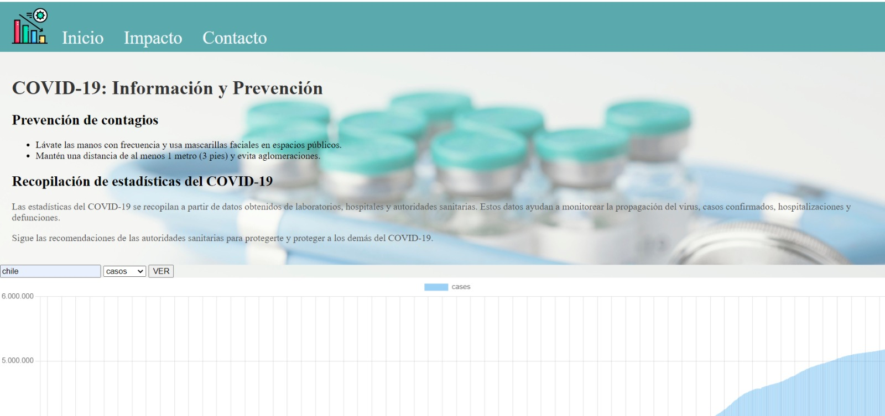

# Proyecto UDD 3 
---
 ## TABLERO DE DATOS DASHBOARD

## Tabla de contenidos

- [Descripción](#descripción) 
- [Capturas de Pantalla](#capturas-de-pantalla)
- [API](#api)
- [Contribuciones](#contribuciones)

## Descripción

El objetivo de este proyecto es proporcionar un tablero interactivo que permita a los usuarios consultar información sobre casos y muertes relacionados con la pandemia en diferentes países. Utilizamos una API para obtener los datos actualizados y los presentamos de manera clara y comprensible en un tablero fácil de usar para todo tipo de publico.

## Capturas de Pantalla

## API
API utilizada desde api ninja
https://api-ninjas.com/api/covid19

## Contribuciones
Proyecto realizado en conjunto junto a Nicolas Farias
https://github.com/Nicfarsal

